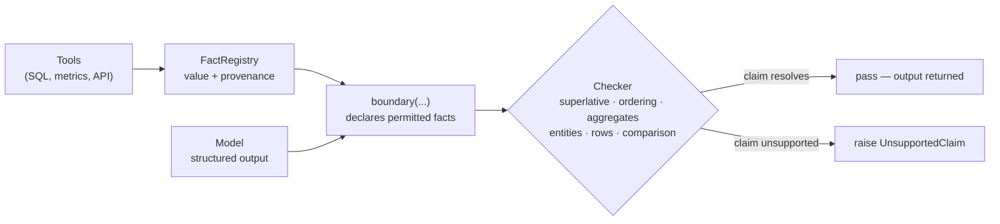

# groundplane

[](https://github.com/ong6/groundplane/actions/workflows/ci.yml)
[](https://pypi.org/project/groundplane/)
[](https://github.com/ong6/groundplane/blob/main/pyproject.toml)
[](https://github.com/ong6/groundplane/blob/main/LICENSE)

A hard line between the parts of an agent's output the model may generate and the parts that must
come from code. When the model crosses it, the build fails loudly.

**Status: v0, in development.** API unstable. Not yet on PyPI.

Groundplane is the runtime end of a small open-source agent-tooling chain.
[Skillpack](https://github.com/ong6/skillpack) holds the instructions an agent loads, and
[Skillsmith](https://github.com/ong6/skillsmith) makes a new instruction and checks whether it earns
its place. Groundplane checks declared facts when that agent runs. The case study and animated
boundary are at [junxiong.dev/groundplane](https://junxiong.dev/groundplane).

## The problem in 60 seconds

An agent calls tools, gets ground truth, then writes prose. The prose usually matches. When it
does not, the failure is silent and confident. The summary names the second-best campaign as the
winner, quotes a plausible number nobody computed, or invents an entity that was not in the result
set. Nothing throws, nothing logs, and the customer reads it.

`groundplane` makes the ground truth *declared*. Tool results are registered as typed facts
with provenance; a boundary names which facts a block of output may reference; a deterministic
checker validates the model's structured output against those facts. An unsupported claim raises.

Scope is narrow on purpose: **bounded, declared facts only**. It is not a general hallucination
detector and not model-based grading. An LLM judge would reintroduce the failure mode being removed.

## What it checks

Six families. Each asks how the recorded facts relate to *each other*, which a per-field validator
cannot see. Every value in a swapped row is a real value, and a wrong
argmax is spelled the same as the right one.

| Check | Failure it catches |
|---|---|
| `superlative` | "Best X" names something other than the computed argmax, or quotes a score that is not the computed one. |
| `ranking_prefix` | A top-k list with the right names in an invented order, an interloper in the last slot, a repeated name, or a cut through a block of tied scores. |
| `aggregate_reconciles` | A total that does not sum, an unweighted mean presented as a weighted one, a filtered aggregate taken over the wrong subset, and any aggregate over a truncated table. |
| `entities_recorded` | A name blended out of two real ones, an id leaked from an earlier tool call, case drift, or an empty list smuggling in a "none qualified" claim. |
| `row_integrity` | Attribute swap: the right row named, with a neighbouring row's value in another field. |
| `comparison` | "A beat B by 12%" where the delta was never computed: wrong sign, percent where percentage points were meant, the ratio quoted as a difference, or the two entities swapped. |

## Flow



## Before / after

`superlative` is the narrowest of the six and the easiest to show.

Before. The winner is whatever the model wrote:

```python
rows = warehouse.query("select campaign, ctr from campaign_daily")
summary = llm(f"Which campaign performed best?\n{rows}")  # says "north". It was "harbour".
```

After. The argmax is computed in code, and the model can only phrase it:

```python
from groundplane import FactRegistry, boundary, superlative

reg = FactRegistry()
reg.record_ranking(
    "campaign_ctr",
    {"north": 0.0412, "harbour": 0.0455, "delta": 0.0301},
    key="ctr",
    tool="warehouse.query",
    args={"table": "campaign_daily", "window": "7d"},
)

with boundary(reg, facts=["campaign_ctr"], checks=[superlative(fact="campaign_ctr")]) as b:
    b.submit(llm_structured(facts=b.facts()))  # {"winner": "north", ...}
```

```
UnsupportedClaim: unsupported claim in field 'winner': model said 'north',
registered facts support 'harbour' | fact='campaign_ctr' |
provenance=warehouse.query(table='campaign_daily', window='7d') |
computed argmax on 'ctr' is 'harbour' (0.0455); 'north' ranked #2 at 0.0412
```

### Report mode

`submit()` stops at the first unsupported claim. When the output feeds a reask loop, the model
should see every problem at once, so `report()` runs every check and collects them:

```python
with boundary(reg, facts=["campaign_ctr"], checks=[superlative(fact="campaign_ctr"), ...]) as b:
    report = b.report(out)  # never raises for a model mistake
if not report.ok:
    reask(report.to_text())  # one line per violation; report.to_dict() for logs
```

`b.submit(out, mode="all")`, or `boundary(..., mode="all")`, does the same and raises
`ClaimsUnsupported` whose `str()` is `report.to_text()` and whose `.report` is the `Report`.
Calling `report()` counts as submitting for the exit check even when it fails. The block was
checked, and what to do with a failing report is the caller's call. A check that raises anything
other than `UnsupportedClaim` (a `ValueError` or `KeyError` from a misconfigured check) still
propagates from `report()`. That is a developer mistake, not a model mistake.

## Install

```bash
pip install groundplane
```

First PyPI release is pending; until then, `pip install -e ".[dev]"` from a checkout.

Requires Python >= 3.10. The core has no runtime dependencies. `groundplane[langgraph]` and
`groundplane[mcp]` pull in those frameworks. The adapters import neither, so they read and test
without either installed.

## API

| Symbol | Purpose |
|---|---|
| `FactRegistry.record(name, value, tool=, args=)` | Register a typed fact with provenance. Write-once. |
| `FactRegistry.record_ranking(name, scores, key=, tool=, higher_is_better=)` | Compute an argmax ordering in code and register it. |
| `FactRegistry.record_table(name, rows, key=, tool=, columns=, exhaustive=)` | Register retrieved rows as a `Table`, keyed by one column. `exhaustive=False` marks a truncated result set. |
| `FactRegistry.record_domain(name, members, tool=, label=)` | Register a closed set of names as a `Domain`. |
| `FactRegistry.tool(name, fact=)` | Decorator that registers a tool function's return value. |
| `boundary(reg, facts=, checks=, require_output=, mode=)` | Context manager **and** decorator, typed: `with ... as b` gives a `Boundary`. Verifies declared facts exist; `b.submit()` runs checks (`mode="first"` raises the first `UnsupportedClaim`, `mode="all"` raises `ClaimsUnsupported` with every violation); `b.report()` returns a `Report` without raising; exiting unchecked raises. |
| `superlative(fact=, winner_field=, score_field=, rank_field=, tolerance=, rel_tolerance=, allow_tie_pick=, column=, higher_is_better=, on_missing=)` | The argmax guard. Reads a `Ranking`, or a `Table` with `column=`. A row missing the column raises unless `on_missing="skip"`, which warns. |
| `field_matches_fact(field=, fact=)` | Assert an output field equals a registered value. |
| `ranking_prefix(fact=, field=, k=, ordered=, allow_tie_pick=, column=, higher_is_better=, on_missing=)` | Top-k guard: a claimed prefix must match the computed ordering, and the cut at k must not fall inside a tie. Reads a `Ranking` or a `Table` column. |
| `aggregate_reconciles(fact=, field=, column=, op=, where=, weight_column=, tolerance=, rel_tolerance=)` | Recompute a stated `sum`/`count`/`mean`/`min`/`max`/`median` over a recorded `Table`. Refuses a non-exhaustive table or a partial column. |
| `entities_recorded(fields=, fact=, path=, allow_empty=, case_sensitive=)` | Every name the model uses must come from a recorded `Domain`, `Ranking`, or `Table` key column. |
| `row_integrity(fact=, key_field=, fields=, tolerance=, rel_tolerance=)` | Resolve the named row first, then read every other field off that one row — catches attribute swap. |
| `comparison(fact=, a_field=, b_field=, delta_field=, column=, kind=, direction=, tolerance=, rel_tolerance=)` | Recompute the delta between two entities in code as `abs`, `pct`, `ratio`, or `pp`; on a mismatch, say which convention the claim actually matches. |
| `Report` | From `b.report(out)`: `violations`, `passed`, `failed` (check names), `ok`, `to_dict()`, `to_text()`. |
| `UnsupportedClaim`, `ClaimsUnsupported`, `UnregisteredFact` | Failures, all subclasses of `FactBoundaryError`. `UnsupportedClaim.to_dict()` is JSON-safe; `ClaimsUnsupported.report` holds the full `Report`. |

Each `X(...)` builder returns a `NamedCheck` (`name` like `superlative(fact='campaign_ctr',
field='winner')`, which is what a `Report` lists) and has an imperative twin,
`check_X(registry, output, ...)`, callable outside a boundary. A plain
`(registry, output) -> None` callable is accepted by `checks=` too and is named after its `__name__`. Facts are write-once; one recorded `Table` can back the superlative, ranking, aggregate,
entity, and row checks at the same time.

Every numeric check takes `tolerance` (absolute) and `rel_tolerance` (relative). Both default to
exact. `rel_tolerance=None` means `rel_tol=0.0`, not `math.isclose`'s usual `1e-9`. A checker built
to catch a wrong number should not forgive nine digits by default. Pass `rel_tolerance=1e-9` for the
stdlib behaviour.

Row keys keep their own type. An `int` id recorded by `record_table` stays an `int` all the way
through `to_ranking`, so a model answering `101` is compared against `101` and never `"101"`.

Boundary checks receive a read-only registry containing only `facts=`. List every fact a check
uses, including facts read by a custom callable; an omitted list permits no facts. Checks called
directly with a registry can use all its facts. This limits ordinary API access, not arbitrary
Python code that already holds the original registry.

Registration and public reads make deep copies of values and provenance arguments. Mutating a
tool response or a prompt builder's copy therefore cannot rewrite recorded evidence. Values must
support `copy.deepcopy`; custom Python objects remain responsible for honest copy and equality
implementations. `submit()` validates the supplied output at that moment and returns the same
object. If the caller changes it later, the changed output needs another check.

Integer values retain their precision, and boolean or floating-point IDs cannot impersonate an
integer key. Aggregates and comparisons use exact intermediate arithmetic, then round fractional
results once to a float. A fractional result that underflows or loses precision at large magnitudes
raises `ValueError`. This can change the last bit compared with separately rounded operations;
use an explicit tolerance for rounded output. Tolerances must be finite and non-negative.

## Adapters

| Symbol | Purpose |
|---|---|
| `adapters.langgraph.guarded_node(fn, registry=, facts=, checks=, output_key=, on_violation=)` | Wrap a LangGraph node so its state update crosses a boundary. Without `on_violation` an unsupported claim fails the run; with it, the claim becomes a state update the graph can route to a reask node. A misconfigured check still propagates — a developer bug is not something to reask the model about. |
| `adapters.langgraph.record_state(registry, state, keys=, tool=)` | Adopt values an upstream node already put in the state as facts. |
| `adapters.mcp.payload_of(result)` | The value an MCP tool result carries. Structured content wins over the text blocks, which are a rendering of it. An `isError` result raises rather than becoming a fact. |
| `adapters.mcp.record_result(registry, name, result, tool=, args=)` | Register an MCP result as a fact with the call as provenance. |
| `adapters.mcp.call_and_record(session, registry, fact=, tool=, arguments=)` | Await an MCP tool call and record what came back. |

Verified against langgraph 1.2.12 and mcp 2.2.0 on 2026-09-26. CI's adapter job runs real
`CallToolResult` objects and compiled synchronous and asynchronous `StateGraph` nodes, including
the reask edge on a wrong argmax. `guarded_node` supports async functions and async callable
objects; the `on_violation` handler remains synchronous. MCP results may be SDK objects or decoded
mappings, and non-finite JSON numbers are rejected. Tool-call provenance captures arguments before
execution, including positional arguments and defaults for `FactRegistry.tool`.

## Claim extraction: structured-output-first

v0 validates **declared fields**, not English. The model emits `{"winner": ..., "ctr": ...}` and the
checker resolves each field against the registry. Parsing prose would need a brittle parser or an
LLM judge. Constraining the model to fields makes the check total and deterministic. Prose
extraction, if it lands, sits on top of this layer, never instead of it. `Boundary.submit()` rejects
a plain string for that reason.

## Adversarial fixtures

`tests/test_superlative_adversarial.py` holds cases where the plausible model answer is provably
wrong: wrong winner, right winner with an invented score, unranked entity, a genuine tie flattened
into one winner, a min/max direction flip, a missing field, a numeric-looking string, and an
inconsistent rank. `test_ordering.py`, `test_aggregates.py`, `test_entities.py`, and `test_rows.py`
do the same for the checks above, and `test_adapters.py` for the two adapters.

## Prior art

Checked 2026-08-27. Star counts as of that date.

| Project | What it validates | Where it stops |
|---|---|---|
| [Guardrails AI](https://github.com/guardrails-ai/guardrails) (7.3k★) | Validators over LLM output, with reask on violation; its provenance validators ask whether generated text is supported by a source document. | Support is decided by embedding similarity or an LLM judge, so the verdict is probabilistic and the input is prose. Nothing is compared against a value computed in code. |
| [Instructor](https://github.com/567-labs/instructor) (13.8k★) | Structured output with Pydantic validation and reask. | The substrate, not a competitor — `groundplane` checks the object Instructor gets back. A field validator sees one field at a time and cannot see a relation that spans several. |
| [agent-citation](https://dev.to/mukundakatta/agent-citation-track-where-every-agent-claim-came-from-3hbd) | That every claim requiring a source has one attached, kept in Python objects rather than re-asked of the model. | Presence, not agreement. A citation can sit on a claim the cited fact contradicts. |
| [GroundProbe](https://github.com/aureliocpr-ctrl/groundprobe) | Tags each claim grounded / inferred / speculative from n-gram, LCS and tf-idf overlap with the source, with an optional LLM tie-break near the thresholds. | Lexical overlap, and it reports a score rather than raising. A wrong argmax is spelled almost exactly like the right one. |

All four ask a version of "does this string appear in, or resemble, a source?". None validates a
**relational** property of the recorded facts: that the named winner is the argmax, that the cut at
k misses a tie, that a stated total reconciles, that the number printed against a row came off that
row. The argmax case alone is about forty lines of Instructor validator. The other four are the
reason to build a library.

## The longer argument

The failure this library exists for is small and does not look like a failure. An agent queries a
table of campaign CTRs, gets seven rows back, and writes "north performed best this week." North was
second. Harbour won. Every word is fluent, the score quoted is real, and nothing in the pipeline
logs a warning. The customer reads it.

You cannot prompt this away. "Only state what is in the data" is an instruction to the exact
component that failed. The model already had the data. Taking the max of seven numbers is trivial,
and it still did not. With sampling in the loop, "usually right" is the ceiling. In production,
usually means the wrong winner ships about once a week, silently.

You also cannot grade it with a second model. An LLM judge asked "does this summary match the data?"
is the same class of component making the same class of mistake, now with a rubber stamp. If the
failure is *the model asserted a relationship between values it did not compute*, the fix cannot be
another uncomputed assertion.

So the fix is boring, and boring is the feature. The argmax is computed in code the moment the
ranking is recorded. `record_ranking` stores the ordering, the winning key, and the provenance of
the tool call that produced it. The model's job shrinks to phrasing. It emits
`{"winner": ..., "ctr": ...}`, and `superlative` resolves those fields against the computed answer.
When they disagree, the boundary raises `UnsupportedClaim`. The message carries the tool call, its
arguments, the computed winner, and where the model's pick ranked, because whoever is debugging this
at 2am needs to know at once whether the data or the prose was wrong.

Three choices I would defend in a review:

**Exact comparison by default.** Every numeric check takes tolerances, but they default to zero.
`rel_tolerance=None` means `rel_tol=0.0`, not `math.isclose`'s usual `1e-9`. A checker built to
catch a wrong number should not forgive nine digits of drift unless you tell it to.

**Facts are write-once.** A registry a later tool call can overwrite is a registry whose provenance
lies. If the fact changed, that is a new fact with its own name and its own tool call.

**An unchecked boundary is an error.** Exit a `boundary` block without calling `submit()` and it
raises. A check that silently never ran is worse than no check, because someone upstream is now
trusting it.

The scope, stated plainly: this validates declared, structured fields against declared, recorded
facts. It is not a hallucination detector. If the model names the right winner and then editorialises
misleadingly around it, that passes. The checker reads fields, not prose. I kept the scope that
narrow because every system I looked at that tried to verify open prose ended up delegating the
verdict to embeddings or a judge model, which brings back the probabilistic verdict this exists to
remove. The six check families all validate *relations between recorded values*: argmax, ordering,
reconciliation, membership, row integrity. That is the ground a per-field validator cannot see and a
similarity score cannot express.

## License

MIT © 2026 Ong Jun Xiong

## More from ong6

Forges make things, packs bundle them.

- [jobforge](https://github.com/ong6/jobforge) — grades the interview plan you say out loud, not the code you submit
- [skillsmith](https://github.com/ong6/skillsmith) — makes an agent skill from your repo, then proves it beats no skill
- [deckforge](https://github.com/ong6/deckforge) — agent-first presentation studio with a measured preflight
- [proofpack](https://github.com/ong6/proofpack) — pilot evidence, review proposals and customer-safe handovers
- [fieldpack](https://github.com/ong6/fieldpack) — deckforge and proofpack as one local-first suite
- [skillpack](https://github.com/ong6/skillpack) — the Claude Code and Codex skills used across all of these
- [uipack](https://github.com/ong6/uipack) — React and SVG figure components behind the diagrams on junxiong.dev
