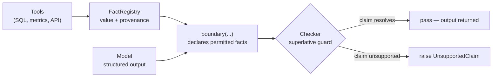

# groundplane

A hard line between the parts of an agent's output the model may generate and the parts that must
come from code — and a loud failure when the model crosses it.

**Status: v0, in development.** API unstable. Name is a working title.

## The problem in 60 seconds

An agent calls tools, gets ground truth, then writes prose. The prose usually happens to match. When
it doesn't, the failure is silent and confident: the summary names the second-best campaign as the
winner, quotes a plausible number nobody computed, or invents an entity that was not in the result
set. Nothing throws. Nothing logs. The customer reads it.

`groundplane` makes the ground truth *declared*. Tool results are registered as typed facts
with provenance; a boundary names which facts a block of output may reference; a deterministic
checker validates the model's structured output against those facts. An unsupported claim raises.

Scope is deliberately narrow: **bounded, declared facts only**. Not a general hallucination detector,
and not model-based grading — an LLM judge would reintroduce the failure mode being removed.

## Flow



## Before / after

Before — the winner is whatever the model wrote:

```python
rows = warehouse.query("select campaign, ctr from campaign_daily")
summary = llm(f"Which campaign performed best?\n{rows}")   # says "north". It was "harbour".
```

After — the argmax is computed in code, and the model can only phrase it:

```python
from groundplane import FactRegistry, boundary, superlative

reg = FactRegistry()
reg.record_ranking(
    "campaign_ctr",
    {"north": 0.0412, "harbour": 0.0455, "delta": 0.0301},
    key="ctr", tool="warehouse.query", args={"table": "campaign_daily", "window": "7d"},
)

with boundary(reg, facts=["campaign_ctr"], checks=[superlative(fact="campaign_ctr")]) as b:
    b.submit(llm_structured(facts=b.facts()))   # {"winner": "north", ...}
```

```
UnsupportedClaim: unsupported claim in field 'winner': model said 'north',
registered facts support 'harbour' | fact='campaign_ctr' |
provenance=warehouse.query(table='campaign_daily', window='7d') |
computed argmax on 'ctr' is 'harbour' (0.0455); 'north' ranked #2 at 0.0412
```

## Install

```bash
pip install -e ".[dev]"   # not yet published to PyPI
pytest
```

Requires Python >= 3.10. The core has no runtime dependencies.

## API

| Symbol | Purpose |
|---|---|
| `FactRegistry.record(name, value, tool=, args=)` | Register a typed fact with provenance. Write-once. |
| `FactRegistry.record_ranking(name, scores, key=, tool=, higher_is_better=)` | Compute an argmax ordering in code and register it. |
| `FactRegistry.record_table(name, rows, key=, tool=, columns=, exhaustive=)` | Register retrieved rows as a `Table`, keyed by one column. `exhaustive=False` marks a truncated result set. |
| `FactRegistry.record_domain(name, members, tool=, label=)` | Register a closed set of names as a `Domain`. |
| `FactRegistry.tool(name, fact=)` | Decorator that registers a tool function's return value. |
| `boundary(reg, facts=, checks=)` | Context manager **and** decorator. Verifies declared facts exist; runs checks on `submit()`; raises if a block exits unchecked. |
| `superlative(fact=, winner_field=, score_field=, rank_field=, tolerance=, allow_tie_pick=)` | The superlative guard. |
| `field_matches_fact(field=, fact=)` | Assert an output field equals a registered value. |
| `ranking_prefix(fact=, field=, k=, ordered=, allow_tie_pick=, column=)` | Top-k guard: a claimed prefix must match the computed ordering, and the cut at k must not fall inside a tie. Reads a `Ranking` or a `Table` column. |
| `aggregate_reconciles(fact=, field=, column=, op=, where=, weight_column=, tolerance=, rel_tolerance=)` | Recompute a stated `sum`/`count`/`mean`/`min`/`max`/`median` over a recorded `Table`. Refuses a non-exhaustive table or a partial column. |
| `entities_recorded(fields=, fact=, path=, allow_empty=, case_sensitive=)` | Every name the model uses must come from a recorded `Domain`, `Ranking`, or `Table` key column. |
| `row_integrity(fact=, key_field=, fields=, tolerance=, rel_tolerance=)` | Resolve the named row first, then read every other field off that one row — catches attribute swap. |
| `UnsupportedClaim`, `UnregisteredFact` | Failures, both subclasses of `FactBoundaryError`. |

Each `X(...)` builder has an imperative twin, `check_X(registry, output, ...)`, callable outside a
boundary. Facts are write-once; one recorded `Table` can back the ranking, aggregate, entity, and
row checks at the same time.

## Claim extraction: structured-output-first

v0 validates **declared fields**, not English. The model emits `{"winner": ..., "ctr": ...}` and the
checker resolves each field against the registry. Parsing prose would need either a brittle parser or
an LLM judge; constraining the model to fields makes the check total and deterministic. Prose
extraction, if it lands, sits on top of this layer — never instead of it. `Boundary.submit()` rejects
a plain string for that reason.

## Checks

| Check | Failure it catches |
|---|---|
| `superlative` | "Best X" names something other than the computed argmax, or quotes a score that is not the computed one. |
| `ranking_prefix` | A top-k list with the right names in an invented order, an interloper in the last slot, a repeated name, or a cut through a block of tied scores. |
| `aggregate_reconciles` | A total that does not sum, an unweighted mean presented as a weighted one, a filtered aggregate taken over the wrong subset, and any aggregate over a truncated table. |
| `entities_recorded` | A name blended out of two real ones, an id leaked from an earlier tool call, case drift, or an empty list smuggling in a "none qualified" claim. |
| `row_integrity` | Attribute swap: the right row named, with a neighbouring row's value in another field. |

## Adversarial fixtures

`tests/test_superlative_adversarial.py` holds cases where the plausible model answer is provably
wrong: wrong winner, right winner with an invented score, unranked entity, a genuine tie flattened
into one winner, a min/max direction flip, a missing field, a numeric-looking string, and an
inconsistent rank. `test_ordering.py`, `test_aggregates.py`, `test_entities.py`, and `test_rows.py`
do the same for the checks above.

## Prior art

**`TODO: verify` — not yet researched. Each line below is an assumption, not a finding.**

| Project | Assumed overlap | Assumed difference |
|---|---|---|
| [Guardrails AI](https://github.com/guardrails-ai/guardrails) | Validators over LLM output, fail/retry on violation | Validates output shape and content rules in isolation; no registry of code-computed facts to check against |
| [NeMo Guardrails](https://github.com/NVIDIA/NeMo-Guardrails) | Rails constraining what an LLM may say | Dialogue/topic and safety rails expressed in Colang; not per-claim provenance resolution |
| [Instructor](https://github.com/567-labs/instructor) | Structured output with Pydantic validation and retries | Validates types and field constraints; does not compare a field to an argmax computed elsewhere |

Being second is fine. Being second and unaware is not — this table gets replaced with real findings
before release.

## License

MIT © 2026 Ong Jun Xiong
